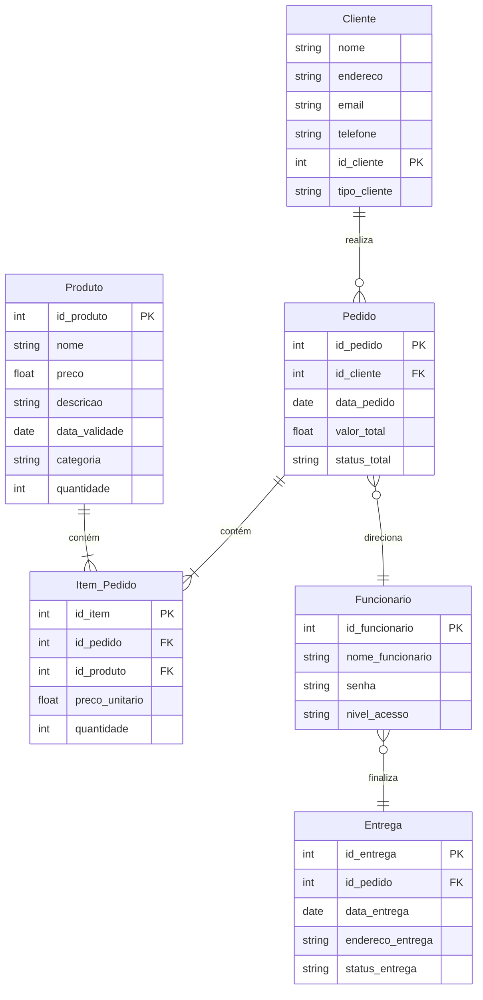

# Bootcamp DIO - Decola Tech 2025 - Floricultura
Java RESTful API criada para BOOTCAMP

```mermaid

erDiagram
    Cliente {
        string nome
        string endereco
        string email
        string telefone
        int id_cliente PK
        string tipo_cliente
    }

    Pedido {
        int id_pedido PK
        int id_cliente FK
        date data_pedido
        float valor_total
        string status_total
    }

    Item_Pedido {
        int id_item PK
        int id_pedido FK
        int id_produto FK
        float preco_unitario
        int quantidade
    }

    Produto {
        int id_produto PK
        string nome
        float preco
        string descricao
        date data_validade
        string categoria
        int quantidade
    }

    Funcionario {
        int id_funcionario PK
        string nome_funcionario
        string senha
        string nivel_acesso
    }

    Entrega {
        int id_entrega PK
        int id_pedido FK
        date data_entrega
        string endereco_entrega
        string status_entrega
    }

    Cliente ||--o{ Pedido : realiza
    Pedido ||--|{ Item_Pedido : "contém"
    Produto ||--|{ Item_Pedido : "contém"
    Pedido }o--|| Funcionario : direciona
    Funcionario }o--|| Entrega : finaliza

```
